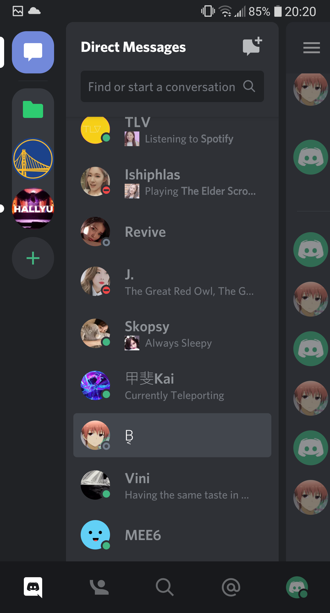
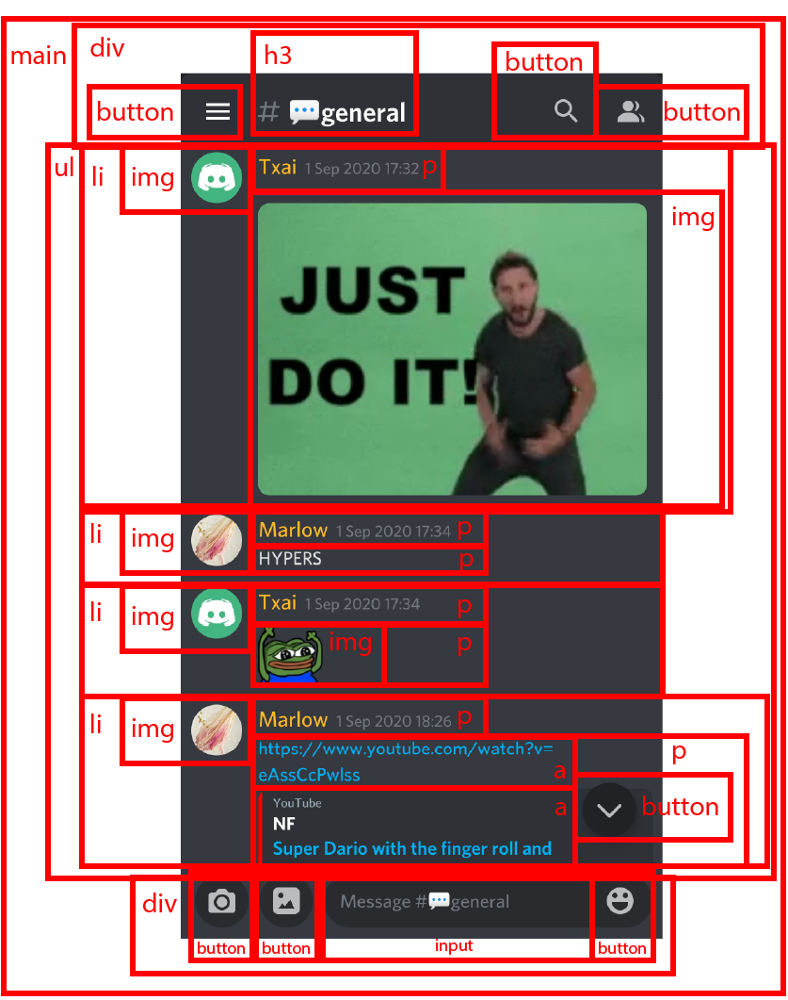

# Procesverslag
**Auteur:** Txai Pereira de Lacerda

**Codepen:** https://codepen.io/txai-hva

Markdown cheat cheet: [Hulp bij het schrijven van Markdown](https://github.com/adam-p/markdown-here/wiki/Markdown-Cheatsheet). Nb. de standaardstructuur en de spartaanse opmaak zijn helemaal prima. Het gaat om de inhoud van je procesverslag. Besteedt de tijd voor pracht en praal aan je website.

## Bronnenlijst
1. -bron 1-
2. -bron 2-
3. -...-

## Eindgesprek (week 7/8)

-dit ging goed & dit was lastig-

**Screenshot(s):**

-screenshot(s) van je eindresultaat-

## Voortgang 3 (week 6)

-same as voortgang 1-

## Voortgang 2 (week 5)

-same as voortgang 1-

## Voortgang 1 (week 3)

### Stand van zaken

Het meeste ging best goed en ik heb tot nu toe niet ergens problemen mee gehad. 

**Screenshot(s):**

### Agenda voor meeting

-samen met je groepje opstellen-

### Verslag van meeting

**Feedback Bas**
Bas vond dat ik goed op weg was en dat het een uitdaging is om Discord na te maken.
Ik heb uitgelegd dat ik de mobiele app namaak, omdat de mobiele website niet goed werkt op mobiel. Verder moet ik opnieuw kijken naar de semantiek van mijn website, aangezien Discord een ongebruikelijk lay-out heeft. Ook zou ik bepaalde buttons kunnen vervangen met linkjes en die kunnen stylen als buttons. Discord Mobile is opgedeeld in tabjes, dus het wordt uitvogelen hoe ik dat ga doen en hoe ik dat responsive maak. 

## Intake (week 1)

**Je startniveau:** rood

**Je focus:** responsive

**Je opdracht:** https://discord.com/app

**Screenshot(s):**

**Breakdown-schets(en):**

