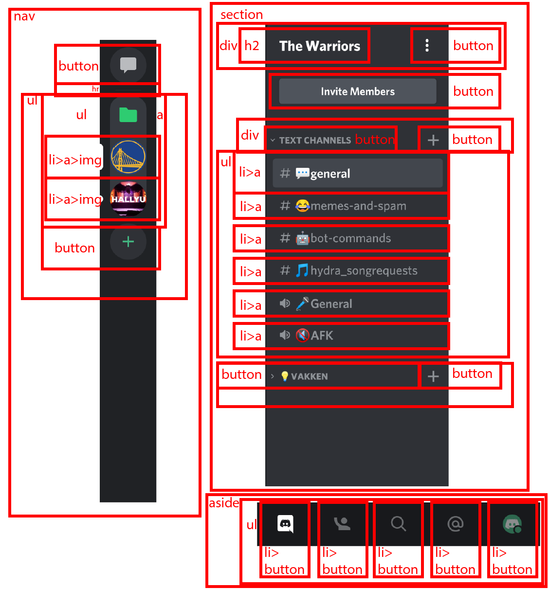
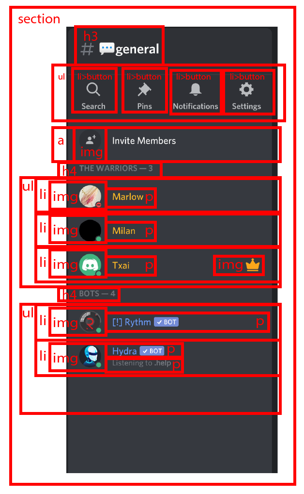
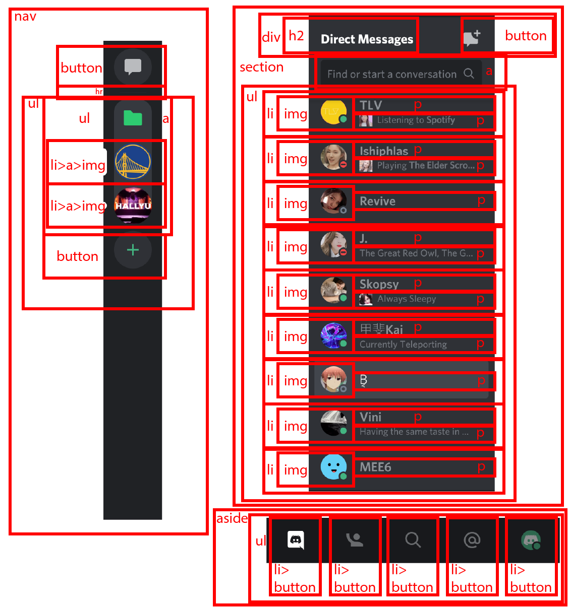

# Procesverslag
**Auteur:** Txai Pereira de Lacerda

**Codepen:** https://codepen.io/txai-hva

Markdown cheat cheet: [Hulp bij het schrijven van Markdown](https://github.com/adam-p/markdown-here/wiki/Markdown-Cheatsheet). Nb. de standaardstructuur en de spartaanse opmaak zijn helemaal prima. Het gaat om de inhoud van je procesverslag. Besteedt de tijd voor pracht en praal aan je website.

## Bronnenlijst
1. https://www.w3schools.com/jsref/met_win_scrollto.asp
2. -bron 2-
3. -...-

## Eindgesprek (week 7/8)

Ik heb de website responsive gemaakt, hover/active/focus states toegevoegt en een hoop kleine aanpassingen. Het responsive maken was best lastig. Ik heb hiervoor grid gebruikt. Ik heb alleen problemen gehad met de focus states. Die werden geactiveerd zodra de active state zou moeten verschijnen.

**Screenshot(s):**

-screenshot(s) van je eindresultaat-

## Voortgang 3 (week 6)

Bas adviseerde mij om te scrollen naar een element inplaats van te scrollen met viewport.
De komende weken moet ik de website responsive maken en wat kleine details toevoegen en aanpassen.

## Voortgang 2 (week 5)

Ik had gevraagd of ik als tweede pagina de direct messaging pagina kon gebruiken, aangezien dat nog best leek op de eerste pagina. Aangezien er genoeg verschillen zijn werd die goedgekeurd.
Ik had een styling probleem bij het server overzicht. In Discord heb je namelijk folders waar je servers in kan slepen. De servers in die folder zaten te hoog en we probeerde dit te fixen, maar dat was niet gelukt. Randy raadde aan flex bij alle relevante elementen uit te zetten. Discord Mobile is opgedeeld in tabjes, dus ik vroeg of Randy misschien een oplossing had. Hij raadde aan viewport te gebruiken hiervoor en transform: translate.

## Voortgang 1 (week 3)

### Stand van zaken

Het meeste ging best goed en ik heb tot nu toe niet ergens problemen mee gehad. 

**Screenshot(s):**

Volgens Bas ben ik goed op weg en hij noemde het een uitdaging om Discord na te maken.
Ik heb uitgelegd dat ik de mobiele app namaak, omdat de mobiele website niet goed werkt op mobiel. Verder moet ik opnieuw kijken naar de semantiek van mijn website, aangezien Discord een ongebruikelijk lay-out heeft. Ook zou ik bepaalde buttons kunnen vervangen met linkjes en die kunnen stylen als buttons. Discord Mobile is opgedeeld in tabjes, dus het wordt uitvogelen hoe ik dat ga doen en hoe ik dat responsive maak. 

## Intake (week 1)

**Je startniveau:** rood

**Je focus:** responsive

**Je opdracht:** https://discord.com/app

**Screenshot(s):**

**Breakdown-schets(en):**

